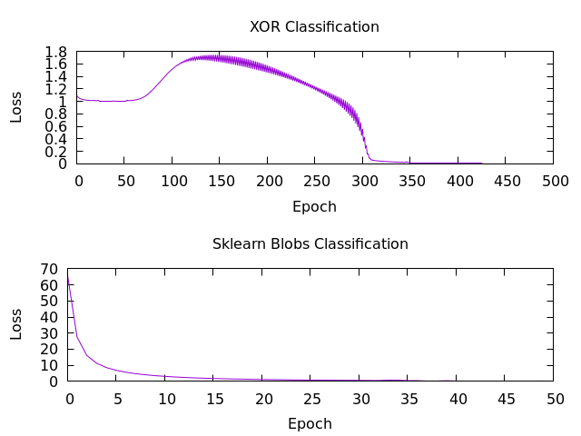

# Neural Networks Implementation in C

Very basic Implementation of some Neural Networks in `C` alongside with Implementation of some Matrix Arithmetics also in `C`.

To build all the examples provided in the `examples` directory do this.
```sh
$ make all
```

# Examples
I provided you with 3 main examples **XOR**, **Sklearn Blobs**, and **Sklearn Diabetes** (does not work well, yet.).
All examples consist of only 2 Layers with `sigmoid` or `ReLU` activations and using `MSE Loss`.

# Demo
Building and Running the `SolveXOR.c` shows.
```sh
$ make xor
$ ./bin/xor.out
Epoch [   0-500], Loss =    1.10381
Epoch [  50-500], Loss =    1.66251
Epoch [ 100-500], Loss =    1.76293
Epoch [ 150-500], Loss =    1.36002
Epoch [ 200-500], Loss =    1.03956
Epoch [ 250-500], Loss =    0.04460
Epoch [ 300-500], Loss =    0.01207
Epoch [ 350-500], Loss =    0.00528
Epoch [ 400-500], Loss =    0.00291
Epoch [ 450-500], Loss =    0.00184

Matrix2D(1, 4)
    0.007383     0.983052     0.983891     0.025838 

Press any key to exit...
```

You can see this graph of the Loss of the `XOR` and `Blobs` Examples

